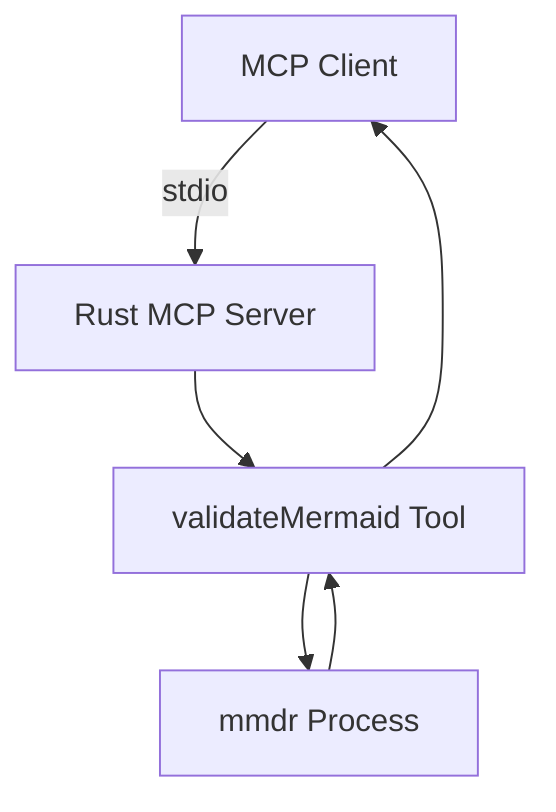
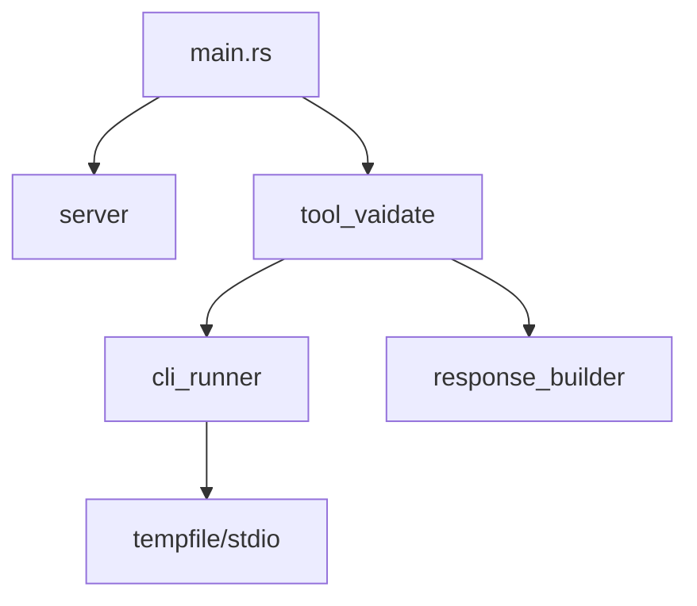

# Dev Plan: Mermaid Validator Rust 重写（mermaid-rs-renderer 方案）

## Input Prerequisites（阻塞项，已部分确认）
| 类别 | 当前状态 | 说明 |
|------|----------|------|
| **仓库/模块** | ✅ 已确认 | 根目录：`/Users/pittcat/Dev/Rust/mermaid_validator_rs`；参考代码：`/Users/pittcat/Dev/Rust/mermaid_validator/mcp-mermaid-validator/src/main.ts` |
| **目标接口** | ✅ 已确认 | MCP 工具 `validateMermaid(diagram, format?)`，**工具名/参数/返回结构必须与 TS 版本完全一致**；参考实现：`@modelcontextprotocol/sdk@^1.10.2` + `@mermaid-js/mermaid-cli@^11.4.2` |
| **运行环境** | ✅ 已确认 | 目标平台已确认：macOS + Linux；Rust 版本 **1.75+**（字体/渲染依赖无额外要求） |
| **约束条件** | ✅ 已确认 | **Rust 机制分发**（不保留 npm 包分发）；**cargo install** 作为分发方式 |
| **渲染依赖** | ✅ 已确认 | 使用 **本地安装** 的 `mmdr` 命令（来自 `mermaid-rs-renderer`）替代 `mermaid-cli`；版本：`mmdr 0.1.2`，路径：`/Users/pittcat/.cargo/bin/mmdr` |
| **已有测试** | ✅ 已确认 | 仓库内暂无 `tests/` 目录；**无外部测试/CI 约束** |

---

## 概览（Overview）

# Dev Plan: Mermaid Validator Rust Rewrite

- **一句话目标**：用 Rust + MCP 官方 SDK 重写 Mermaid Validator，通过本地 `mmdr` 渲染（无浏览器/Node 依赖），并保持 `validateMermaid` 行为兼容。
- **优先级**：[P1]
- **预计时间**：7–12 天（不含需求确认与发布流程变更评审）
- **当前状态**：[PLANNING]

---

## 背景与目标（Background & Goals）

### 为什么做（Why）
- 现有实现依赖 Node 子进程与 `mermaid-cli`，启动开销和环境依赖较重
- `mermaid-rs-renderer` 提供 `mmdr` CLI，支持 SVG/PNG，去除浏览器/Node 依赖，适合 Rust 机制分发
- 希望保持接口一致的同时，降低运行时依赖与启动成本

### 要达到什么目标（What）
**可验证目标**：
1. MCP 工具 `validateMermaid` 在 Rust 版本中可用，参数与输出与当前 TypeScript 版本一致（默认 PNG、支持 SVG）。
2. 对同一输入图表，Rust 版本输出图像可被 MCP 客户端正常识别（`mimeType` 正确、base64 可解码）。
3. 错误输出包含主错误 +（若存在）渲染错误详情，结构与当前版本对齐。
4. 新项目可通过 `cargo build` / `cargo run` 构建运行，无需 Node/Chromium。

### 范围边界与依赖风险（Out of Scope / Dependencies / Risks）
| 类型 | 内容 | 说明 |
|------|------|------|
| **Out of Scope** | Mermaid 语法实现 | 依赖 `mermaid-rs-renderer` 的支持范围 |
| **Out of Scope** | 新增 MCP 工具 | 只重写 `validateMermaid` |
| **Out of Scope** | Windows 支持 | 仅支持 macOS + Linux |
| **Dependencies** | `mmdr` CLI | 依赖本地安装的 `mmdr` 命令；需记录版本与安装方式 |
| **Dependencies** | Rust MCP SDK (`rmcp`) | 需确认目标版本/API 稳定性；参考：TypeScript 使用 `@modelcontextprotocol/sdk@^1.10.2` |
| **Risks** | Mermaid 功能子集差异 | `mermaid-rs-renderer` 支持的图表类型可能与 Mermaid.js 完全版存在差异，需确认与现有用例兼容 |
| **Risks** | PNG 渲染依赖 | PNG 输出依赖 `png` feature + 渲染栈（如 resvg/usvg） |
| **Risks** | 本地依赖一致性 | 本地 `mmdr` 版本不一致可能导致输出差异 |

### 完成判据与验收映射（Success Criteria & Verification）
| 目标 | 验证命令/检查点 |
|------|----------------|
| MCP 工具注册成功 | `cargo run` 后用 MCP Inspector 调用 `validateMermaid`（人工检查点） |
| PNG 渲染输出可解码 | `cargo test -p mermaid_validator -- tests::render_png` |
| SVG 渲染输出可解码 | `cargo test -p mermaid_validator -- tests::render_svg` |
| 错误输出结构一致 | `cargo test -p mermaid_validator -- tests::invalid_diagram` |
| 构建可用 | `cargo build --release` |
| 分发可用 | `cargo install --path .` |

---

## 技术方案（Technical Design）

### 高层架构（Mermaid）


### 核心流程（ASCII）
```
[请求] -> [参数解析] -> [生成临时 .mmd 文件] -> [调用 mmdr CLI]
   -> [读取 SVG/PNG 输出] -> [base64 编码] -> [MCP 响应]
   -> 失败: [解析 stderr/退出码] -> [MCP 响应]
```

### 技术栈
- 语言 / 框架：Rust + tokio + rmcp
- 渲染依赖：本地 `mmdr` CLI（来自 `mermaid-rs-renderer`，输出 SVG/PNG）
- 进程管理：tokio::process / std::process（stdio + 临时文件）
- 数据编码：base64
- 错误处理：thiserror / anyhow

### 参考接口定义（来自 TypeScript 版本）
**工具名**：`validateMermaid`

**参数**：
```typescript
{
  diagram: string,  // Mermaid 图表定义（.mmd 格式）
  format?: "svg" | "png"  // 输出格式，默认 "png"
}
```

**成功响应结构**：
```typescript
{
  content: [
    { type: "text", text: "Mermaid diagram is valid" },
    {
      type: "image",
      data: "<base64编码的图像数据>",
      mimeType: "image/png" | "image/svg+xml"
    }
  ]
}
```

**错误响应结构**：
```typescript
{
  content: [
    { type: "text", text: "Mermaid diagram is invalid" },
    { type: "text", text: "<主错误信息>" },
    { type: "text", text: "Detailed error output:\n<详细错误输出>" }  // 可选
  ]
}
```

**渲染命令差异**：
- TypeScript 版本：`npx @mermaid-js/mermaid-cli -i /dev/stdin -o - -e <format>`
- Rust 版本：`mmdr -i <input.mmd> -o <output> --format <format>` （待确认具体参数）

### 关键技术点
- [CORE] `validateMermaid` 输出结构与当前 TS 版本一致
- [CORE] PNG/SVG 渲染路径与参数一致（默认 PNG）
- [NOTE] 需要明确 `mmdr` CLI 的输入/输出参数（stdin vs 文件，输出格式选项）
- [NOTE] Mermaid 特性子集差异需明确并在 README 中提示
- [OPT] 渲染超时（CPU 绑定）与并发控制（后续优化）

### 模块设计（中等粒度）


---

## 实施计划（Implementation Plan）

### 阶段 1：基础框架
- 预计时间：2–3 天
- 交付物：Rust MCP Server 骨架 + 最小可运行工具

#### Task 1.1: 确认输入前置条件
| 项目 | 内容 |
|------|------|
| 目标 | 确认接口兼容性、平台支持、依赖版本策略 |
| 代码范围 | 无 |
| 预期改动 | 需求确认（人工） |

**验证命令**：
```
人工检查点：确认以下问题并记录结论
- 已确认：工具名/参数/输出结构保持与 TS 版本完全一致
- 已确认：目标平台仅 macOS + Linux（无需 Windows）
- 已确认：使用本地安装的 `mmdr` 命令，记录版本与安装方式
- 已确认：分发方式为 `cargo install`
- 已确认：Rust 版本 1.75+，系统字体/渲染依赖无额外要求
- 已确认：mermaid-rs-renderer 支持的图表类型覆盖现有用例
- 已确认：`mmdr` 命令可用（路径：`/Users/pittcat/.cargo/bin/mmdr`），版本：`mmdr 0.1.2`
- 已确认：无外部测试/CI 约束
```

**完成判定**：
- [PASS] 结论已确认并写入本计划“约束条件”

**门禁规则**：
[BLOCK] 禁止开始 Task 1.2，直到本 Task 验证通过

**当前状态**：[DONE]

---

#### Task 1.2: 新建 Rust 工程骨架
| 项目 | 内容 |
|------|------|
| 目标 | 创建 Rust crate 与基础目录结构 |
| 代码范围 | `Cargo.toml`, `src/main.rs`, `src/lib.rs` |
| 预期改动 | 引入基础依赖（rmcp, tokio, serde, base64, thiserror）；运行时依赖 `mmdr` 命令 |

**验证命令**：
```bash
cargo check
```

**完成判定**：
- [PASS] `cargo check` Exit Code = 0

**门禁规则**：
[BLOCK] 禁止开始 Task 1.3，直到本 Task 验证通过

**当前状态**：[TODO]

---

#### Task 1.3: MCP Server 最小可运行
| 项目 | 内容 |
|------|------|
| 目标 | MCP Server 可启动并注册 `validateMermaid` 工具 |
| 代码范围 | `src/main.rs`, `src/server.rs` |
| 预期改动 | 工具暂返回固定文本，验证 MCP 通路 |

**验证命令**：
```bash
cargo run
```

**完成判定**：
- [PASS] MCP Inspector 可调用工具并收到响应（人工检查点）

**门禁规则**：
[BLOCK] 禁止开始 Task 2.1，直到本 Task 验证通过

**当前状态**：[TODO]

---

### 阶段 2：核心功能
- 预计时间：3–5 天
- 交付物：完整渲染、输出编码、错误处理

#### Task 2.1: 适配 mmdr CLI（SVG）
| 项目 | 内容 |
|------|------|
| 目标 | 使用 `mmdr` 生成 SVG 输出 |
| 代码范围 | `src/cli_runner.rs` |
| 预期改动 | 生成临时 `.mmd` 文件，调用 `mmdr` 输出 SVG 文件并读取内容 |

**验证命令**：
```bash
cargo test -p mermaid_validator -- tests::render_svg
```

**完成判定**：
- [PASS] SVG 输出可解码且包含 `<svg` 头

**门禁规则**：
[BLOCK] 禁止开始 Task 2.2，直到本 Task 验证通过

**当前状态**：[TODO]

---

#### Task 2.2: PNG 渲染路径接入
| 项目 | 内容 |
|------|------|
| 目标 | 输出 PNG（默认格式） |
| 代码范围 | `src/cli_runner.rs` |
| 预期改动 | 通过 `mmdr` 输出 PNG 文件并读取为 buffer |

**验证命令**：
```bash
cargo test -p mermaid_validator -- tests::render_png
```

**完成判定**：
- [PASS] PNG 输出可解码且 mimeType 为 `image/png`

**门禁规则**：
[BLOCK] 禁止开始 Task 2.3，直到本 Task 验证通过

**当前状态**：[TODO]

---

#### Task 2.3: 错误映射与输出结构对齐
| 项目 | 内容 |
|------|------|
| 目标 | 统一错误格式与 TS 版本对齐 |
| 代码范围 | `src/response_builder.rs`, `src/server.rs` |
| 预期改动 | 标准化 `invalid`/`error` 内容结构 |

**验证命令**：
```bash
cargo test -p mermaid_validator -- tests::invalid_diagram
```

**完成判定**：
- [PASS] 错误输出结构与预期一致

**门禁规则**：
[BLOCK] 禁止开始 Task 2.4，直到本 Task 验证通过

**当前状态**：[TODO]

---

#### Task 2.4: 渲染超时与资源控制
| 项目 | 内容 |
|------|------|
| 目标 | 避免极端大图导致阻塞 |
| 代码范围 | `src/cli_runner.rs` |
| 预期改动 | `MERMAID_TIMEOUT` 环境变量控制超时 |

**验证命令**：
```bash
cargo test -p mermaid_validator -- tests::timeout_handling
```

**完成判定**：
- [PASS] 超时返回可识别错误

**门禁规则**：
[BLOCK] 禁止开始 Task 3.1，直到本 Task 验证通过

**当前状态**：[TODO]

---

### 阶段 3：集成与测试
- 预计时间：2–4 天
- 交付物：可发布版本 + 文档 + 最小测试矩阵

#### Task 3.1: 添加测试用例
| 项目 | 内容 |
|------|------|
| 目标 | 覆盖 svg/png/invalid/timeout |
| 代码范围 | `tests/` |
| 预期改动 | 基础单元测试 + 可选集成测试 |

**验证命令**：
```bash
cargo test
```

**完成判定**：
- [PASS] 所有测试通过

**门禁规则**：
[BLOCK] 禁止开始 Task 3.2，直到本 Task 验证通过

**当前状态**：[TODO]

---

#### Task 3.2: 文档与使用方式对齐
| 项目 | 内容 |
|------|------|
| 目标 | README 更新 Rust 运行/安装方式与依赖说明 |
| 代码范围 | `README.md`, `docs/` |
| 预期改动 | 移除 npm 发布说明，新增 `cargo install` 分发说明 |

**验证命令**：
```
人工检查点：README 命令可执行且说明清晰
```

**完成判定**：
- [PASS] 文档审阅完成

**门禁规则**：
[BLOCK] 禁止开始 Task 3.3，直到本 Task 验证通过

**当前状态**：[TODO]

---

#### Task 3.3: 发布与分发方案落地
| 项目 | 内容 |
|------|------|
| 目标 | 完成 `cargo install` 分发流程 |
| 代码范围 | `Cargo.toml`, 发布脚本或 CI（待确认） |
| 预期改动 | 明确 `cargo install` 使用方式与版本发布规范 |

**验证命令**：
```
cargo install --path .
```

**完成判定**：
- [PASS] `cargo install --path .` Exit Code = 0

**门禁规则**：
[BLOCK] 禁止标记整体完成，直到本 Task 验证通过

**当前状态**：[TODO]

---

## 失败处理协议（Error-Handling Protocol）
| 级别 | 触发条件 | 处理策略 |
|------|----------|----------|
| Level 1 | 验证失败 | 记录假设 -> 阅读错误日志 -> 原地修复 -> 重新验证（最多 3 次） |
| Level 2 | 连续 3 次失败 | 回读 README/接口定义，校验理解是否错误，并记录原因 |
| Level 3 | 仍失败 | [STOP] 停止编码，记录 Blocker，等待用户确认 |

**重试规则**：
- 每次修复必须更新 Task 状态与失败原因
- 禁止绕过测试或硬编码返回值

---

## Anti-Patterns（负约束）
- [FORBIDDEN] 禁止删除或弱化现有断言
- [FORBIDDEN] 禁止为了通过测试而硬编码返回值
- [FORBIDDEN] 禁止跳过验证步骤
- [FORBIDDEN] 禁止引入未声明依赖
- [FORBIDDEN] 禁止使用 any / disable lint / ignore type check

---

## 状态同步机制（Stateful Plan）
- [DONE] 已完成（验证通过）
- [TODO] 未开始
- [DOING] 进行中
- [BLOCKED] 阻塞
- [PASS] 验证通过
- [FAIL] 验证失败

**强制要求**：
- 每次 Task 执行后必须更新状态
- 未通过验证不得标记 [DONE]

---

## 质量检查清单
- [CHECK] 所有 Task 都有验证命令
- [CHECK] 所有 Task 都是原子级（单一目的、可回滚）
- [CHECK] 有失败处理协议
- [CHECK] 有 Anti-Patterns
- [CHECK] Plan 可被 Agent 连续执行不中断
- [CHECK] 有输入前置条件记录
- [CHECK] 有完成判据与验收映射
